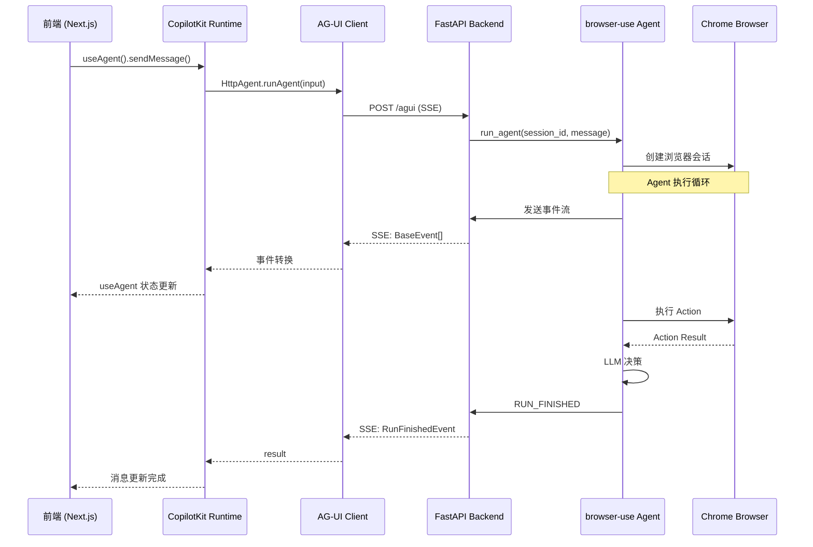
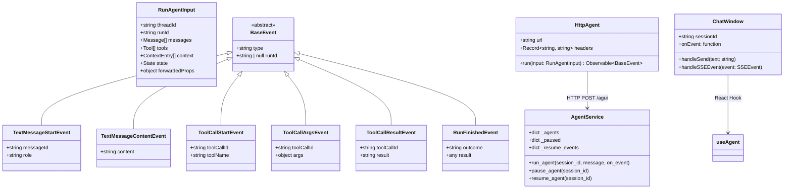
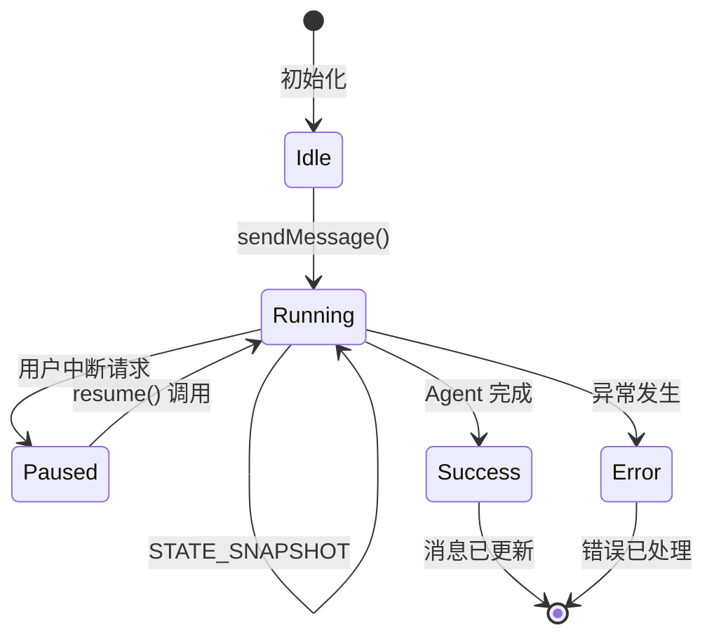
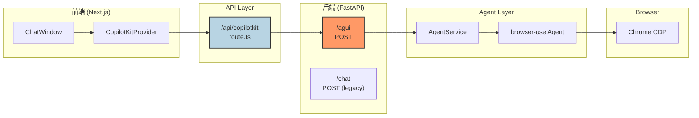
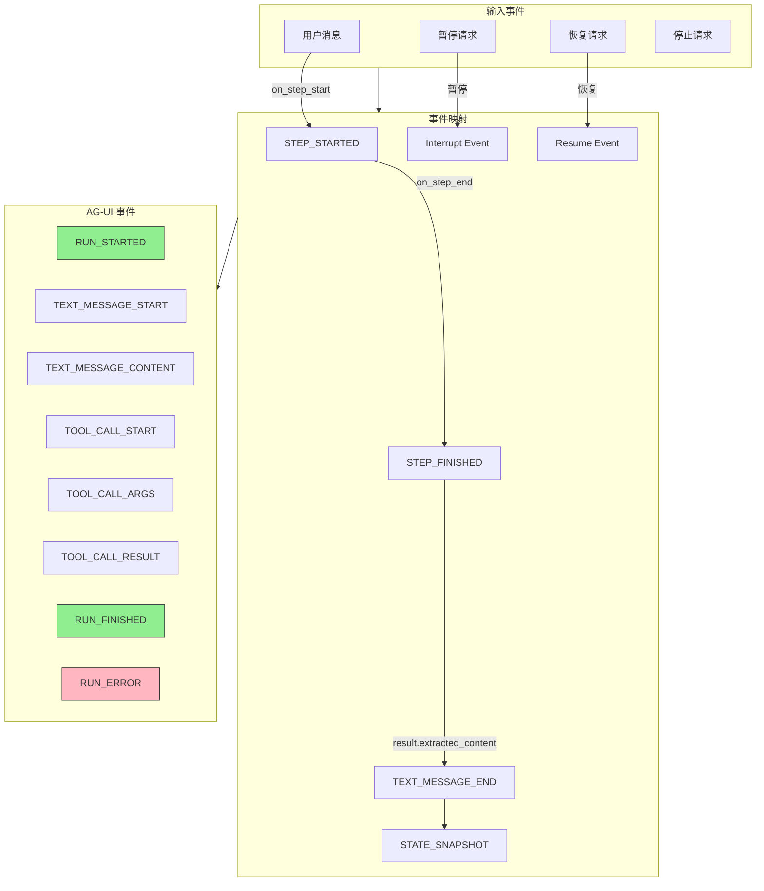

# UML 模型图: AG-UI 协议集成

## 1. 架构序列图

```mermaid
sequenceDiagram
    participant Frontend as 前端 (Next.js)
    participant CopilotKit as CopilotKit Runtime
    participant AGUI as AG-UI Client
    participant Backend as FastAPI Backend
    participant Agent as browser-use Agent
    participant Browser as Chrome Browser

    Frontend->>CopilotKit: useAgent().sendMessage()
    CopilotKit->>AGUI: HttpAgent.runAgent(input)
    AGUI->>Backend: POST /agui (SSE)
    Backend->>Agent: run_agent(session_id, message)
    Agent->>Browser: 创建浏览器会话

    Note over Agent,Browser: Agent 执行循环

    Agent->>Backend: 发送事件流
    Backend-->>AGUI: SSE: BaseEvent[]
    AGUI-->>CopilotKit: 事件转换
    CopilotKit-->>Frontend: useAgent 状态更新

    Agent->>Browser: 执行 Action
    Browser-->>Agent: Action Result
    Agent->>Agent: LLM 决策

    Agent->>Backend: RUN_FINISHED
    Backend-->>AGUI: SSE: RunFinishedEvent
    AGUI-->>CopilotKit: result
    CopilotKit-->>Frontend: 消息更新完成
```

## 2. 组件类图

```mermaid
classDiagram
    class RunAgentInput {
        +string threadId
        +string runId
        +Message[] messages
        +Tool[] tools
        +ContextEntry[] context
        +State state
        +object forwardedProps
    }

    class BaseEvent {
        <<abstract>>
        +string type
        +string | null runId
    }

    class TextMessageStartEvent {
        +string messageId
        +string role
    }

    class TextMessageContentEvent {
        +string content
    }

    class ToolCallStartEvent {
        +string toolCallId
        +string toolName
    }

    class ToolCallArgsEvent {
        +string toolCallId
        +object args
    }

    class ToolCallResultEvent {
        +string toolCallId
        +string result
    }

    class RunFinishedEvent {
        +string outcome
        +any result
    }

    BaseEvent <|-- TextMessageStartEvent
    BaseEvent <|-- TextMessageContentEvent
    BaseEvent <|-- ToolCallStartEvent
    BaseEvent <|-- ToolCallArgsEvent
    BaseEvent <|-- ToolCallResultEvent
    BaseEvent <|-- RunFinishedEvent

    class HttpAgent {
        +string url
        +Record~string, string~ headers
        +run(input: RunAgentInput) Observable~BaseEvent~
    }

    class AgentService {
        +dict _agents
        +dict _paused
        +dict _resume_events
        +run_agent(session_id, message, on_event)
        +pause_agent(session_id)
        +resume_agent(session_id)
    }

    class ChatWindow {
        +string sessionId
        +onEvent: function
        +handleSend(text: string)
        +handleSSEEvent(event: SSEEvent)
    }

    HttpAgent --> AgentService: HTTP POST /agui
    ChatWindow --> useAgent: React Hook
```

## 3. 状态图

```mermaid
stateDiagram-v2
    [*] --> Idle: 初始化
    Idle --> Running: sendMessage()
    Running --> Running: Step Executing
    Running --> Paused: 用户中断请求
    Paused --> Running: resume() 调用
    Running --> Success: Agent 完成
    Running --> Error: 异常发生
    Success --> [*]: 消息已更新
    Error --> [*]: 错误已处理

    Running --> Running: TEXT_MESSAGE_START
    Running --> Running: TEXT_MESSAGE_CONTENT
    Running --> Running: TEXT_MESSAGE_END
    Running --> Running: TOOL_CALL_START
    Running --> Running: TOOL_CALL_ARGS
    Running --> Running: TOOL_CALL_RESULT
    Running --> Running: TOOL_CALL_END
    Running --> Running: STEP_STARTED
    Running --> Running: STEP_FINISHED
    Running --> Running: STATE_SNAPSHOT
```

## 4. API 端点图

```mermaid
flowchart LR
    subgraph Frontend["前端 (Next.js)"]
        Chat[ChatWindow]
        Provider[CopilotKitProvider]
    end

    subgraph API["API Layer"]
        Route["/api/copilotkit\nroute.ts"]
    end

    subgraph Backend["后端 (FastAPI)"]
        AGUI["/agui\nPOST"]
        ChatOld["/chat\nPOST (legacy)"]
    end

    subgraph Agent["Agent Layer"]
        Service["AgentService"]
        AgentCore["browser-use Agent"]
    end

    subgraph Browser["Browser"]
        Chrome["Chrome CDP"]
    end

    Chat --> Provider
    Provider --> Route
    Route --> AGUI
    AGUI --> Service
    Service --> AgentCore
    AgentCore --> Chrome

    style AGUI fill:#f96,stroke:#333,stroke-width:2px
    style Route fill:#b8d4e3,stroke:#333,stroke-width:2px
```

## 5. 事件流转图

```mermaid
flowchart TB
    subgraph Input["输入事件"]
        MSG["用户消息"]
        PAUSE["暂停请求"]
        RESUME["恢复请求"]
        STOP["停止请求"]
    end

    subgraph Mapping["事件映射"]
        direction TB
        MSG -->|on_step_start| STEP_START["STEP_STARTED"]
        STEP_START -->|on_step_end| STEP_END["STEP_FINISHED"]
        STEP_END -->|result.extracted_content| TXT_END["TEXT_MESSAGE_END"]
        TXT_END --> STATE["STATE_SNAPSHOT"]
        PAUSE -->|暂停| INTERRUPT["Interrupt Event"]
        RESUME -->|恢复| RESUME_EV["Resume Event"]
    end

    subgraph Output["AG-UI 事件"]
        RUN_START["RUN_STARTED"]
        TEXT_START["TEXT_MESSAGE_START"]
        TEXT_CONTENT["TEXT_MESSAGE_CONTENT"]
        TOOL_START["TOOL_CALL_START"]
        TOOL_ARGS["TOOL_CALL_ARGS"]
        TOOL_RESULT["TOOL_CALL_RESULT"]
        RUN_FINISH["RUN_FINISHED"]
        RUN_ERROR["RUN_ERROR"]
    end

    Mapping --> Output
    Input --> Mapping

    style RUN_START fill:#90EE90,stroke:#333
    style RUN_FINISH fill:#90EE90,stroke:#333
    style RUN_ERROR fill:#FFB6C1,stroke:#333
```
