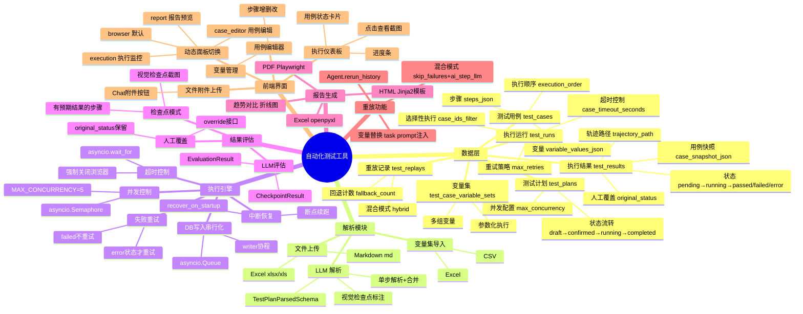

# 自动化测试工具思维导图

```mermaid
mindmap
  root((自动化测试工具))
    数据层
      测试计划 test_plans
        状态流转 draft→confirmed→running→completed
        并发配置 max_concurrency
      测试用例 test_cases
        步骤 steps_json
        变量 variable_values_json
        执行顺序 execution_order
      变量集 test_case_variable_sets
        参数化执行
        多组变量
      执行运行 test_runs
        超时控制 case_timeout_seconds
        重试策略 max_retries
        选择性执行 case_ids_filter
      执行结果 test_results
        状态 pending→running→passed/failed/error
        用例快照 case_snapshot_json
        人工覆盖 original_status
        轨迹路径 trajectory_path
      重放记录 test_replays
        混合模式 hybrid
        回退计数 fallback_count
    解析模块
      文件上传
        Excel xlsx/xls
        Markdown md
      LLM 解析
        单步解析+合并
        TestPlanParsedSchema
        视觉检查点标注
      变量集导入
        CSV
        Excel
    执行引擎
      并发控制
        asyncio.Semaphore
        MAX_CONCURRENCY=5
      超时控制
        asyncio.wait_for
        强制关闭浏览器
      失败重试
        error状态才重试
        failed不重试
      中断恢复
        recover_on_startup
        断点续跑
      DB写入串行化
        asyncio.Queue
        writer协程
    结果评估
      检查点模式
        有预期结果的步骤
        视觉检查点截图
      LLM评估
        CheckpointResult
        EvaluationResult
      人工覆盖
        override接口
        original_status保留
    报告生成
      HTML Jinja2模板
      PDF Playwright
      Excel openpyxl
      趋势对比 折线图
    重放功能
      Agent.rerun_history
      变量替换 task prompt注入
      混合模式 skip_failures+ai_step_llm
    前端界面
      动态面板切换
        browser 默认
        case_editor 用例编辑
        execution 执行监控
        report 报告预览
      用例编辑器
        步骤增删改
        变量管理
      执行仪表板
        进度条
        用例状态卡片
        点击查看截图
      文件附件上传
        Chat附件按钮
```
