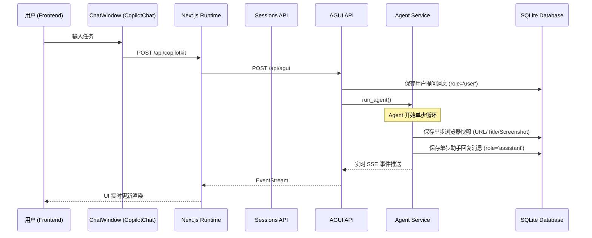
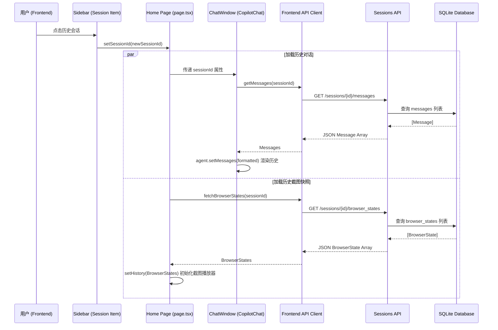

# UML 模型图: 数据持久化与历史展示

## 1. 架构序列图: 运行与持久化流程

```mermaid
sequenceDiagram
    participant User as 用户 (Frontend)
    participant Chat as ChatWindow (CopilotChat)
    participant NextJS as Next.js Runtime
    participant FastAPISes as Sessions API
    participant FastAPIAgui as AGUI API
    participant AgentService as Agent Service
    participant DB as SQLite Database

    %% User inputs prompt
    User->>Chat: 输入任务
    Chat->>NextJS: POST /api/copilotkit
    NextJS->>FastAPIAgui: POST /api/agui

    %% Save User Message
    FastAPIAgui->>DB: 保存用户提问消息 (role='user')
    FastAPIAgui->>AgentService: run_agent()

    %% Agent execution loop
    Note over AgentService: Agent 开始单步循环
    
    AgentService->>DB: 保存单步浏览器快照 (URL/Title/Screenshot)
    AgentService->>DB: 保存单步助手回复消息 (role='assistant')

    AgentService-->>FastAPIAgui: 实时 SSE 事件推送
    FastAPIAgui-->>NextJS: EventStream
    NextJS-->>User: UI 实时更新渲染
```

## 2. 架构序列图: 会话切换与历史恢复流程

```mermaid
sequenceDiagram
    participant User as 用户 (Frontend)
    participant Sidebar as Sidebar (Session Item)
    participant Page as Home Page (page.tsx)
    participant Chat as ChatWindow (CopilotChat)
    participant API as Frontend API Client
    participant FastAPISes as Sessions API
    participant DB as SQLite Database

    User->>Sidebar: 点击历史会话
    Sidebar->>Page: setSessionId(newSessionId)
    
    %% Load History Messages
    Par 加载历史对话
        Page->>Chat: 传递 sessionId 属性
        Chat->>API: getMessages(sessionId)
        API->>FastAPISes: GET /sessions/{id}/messages
        FastAPISes->>DB: 查询 messages 列表
        DB-->>FastAPISes: [Message]
        FastAPISes-->>API: JSON Message Array
        API-->>Chat: Messages
        Chat->>Chat: agent.setMessages(formatted) 渲染历史
    %% Load History Screenshots
    and 加载历史截图快照
        Page->>API: fetchBrowserStates(sessionId)
        API->>FastAPISes: GET /sessions/{id}/browser_states
        FastAPISes->>DB: 查询 browser_states 列表
        DB-->>FastAPISes: [BrowserState]
        FastAPISes-->>API: JSON BrowserState Array
        API-->>Page: BrowserStates
        Page->>Page: setHistory(BrowserStates) 初始化截图播放器
    end
```
