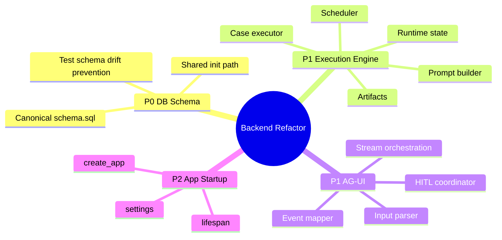

# Backend Architecture Refactor Mind Map

```mermaid
mindmap
  root((Backend Refactor))
    P0 DB Schema
      Canonical schema.sql
      Shared init path
      Test schema drift prevention
    P1 Execution Engine
      Scheduler
      Runtime state
      Case executor
      Artifacts
      Prompt builder
    P1 AG-UI
      Input parser
      Event mapper
      HITL coordinator
      Stream orchestration
    P2 App Startup
      create_app
      lifespan
      settings
```
