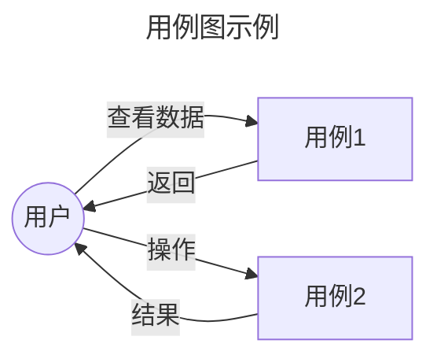

# 需求分析

## 核心原则

### 1. 需求完整性
- 输入输出必须完整定义，无遗漏
- 边界条件和异常场景必须覆盖
- 验收标准必须清晰可验证

### 2. 需求可执行性
- 每个子任务可独立执行
- 任务间依赖关系明确
- 避免模糊表述

### 3. 需求可追溯性
- 从用户需求到任务可一一追溯
- 变更可追踪、可回滚

## 工作流程

### 阶段 1: 需求理解

**目标**: 准确理解用户需求，明确项目范围和边界

**动作**:
1. 仔细阅读用户需求描述，提取核心需求
2. 识别涉及的模块、组件、用户角色
3. 识别与现有系统的集成点
4. 识别潜在风险和约束条件

**产出**: 初步需求理解笔记

### 阶段 2: 需求澄清

**目标**: 消除需求中的模糊性，补充缺失信息

**动作**:
1. 生成澄清问题清单，每个问题提供推荐解决方案
2. 与用户确认关键决策
3. 补充缺失的业务规则和约束

**澄清维度**:
| 维度 | 示例问题 |
|------|----------|
| 输入 | 数据的格式、来源、校验规则 |
| 输出 | 数据的格式、目的地、展示方式 |
| 边界 | 最大并发、最长响应时间、数据量上限 |
| 异常 | 超时处理、降级策略、错误恢复 |
| 依赖 | 外部服务、第三方库、基础设施 |

**产出**: 澄清问题与解答记录

### 阶段 3: 产出定义

**目标**: 明确输入输出，定义数据边界

**输出格式模板**:
```markdown
## 输入
| 参数 | 类型 | 来源 | 描述 | 校验规则 |
|------|------|------|------|----------|
| param1 | string | 用户输入 | xxx | 必填，最大100字符 |

## 输出
| 返回值 | 类型 | 格式 | 描述 |
|--------|------|------|------|
| result | object | JSON | xxx |
```

### 阶段 4: 树形图生成 (xmind.md)

**目标**: 以树形图形式梳理业务需求整体结构

**动作**:
1. 确定根节点（需求名称）
2. 识别一级节点（核心模块、用户角色、业务流程）
3. 展开二级节点（子功能、输入输出、边界条件）
4. 标注叶子节点（实现细节、待确认问题）

**规范**: 见下方 xmind.md 树形图规范

### 阶段 5: UML 图生成 (uml.md, 可选)

**目标**: 用 UML 图深入分析复杂业务逻辑

**动作**:
1. 识别需要 UML 图的场景
2. 选择合适的 UML 图类型
3. 生成 Mermaid 格式的 UML 图

**适用场景**:
- 用例图: 功能边界清晰、参与者多
- 活动图: 业务流程复杂、分支多
- 序列图: API 调用顺序复杂、跨系统协作
- 类图: 领域模型复杂、实体关系多

### 阶段 6: 任务拆分

**目标**: 将需求拆分为可执行的子任务

**动作**:
1. 按模块/层级拆分子任务
2. 每个子任务包含: 目标、范围、输入、输出、验收标准、依赖关系
3. 排序任务，识别关键路径
4. 评估工作量和风险

**任务卡片模板**:
```markdown
### Task: [任务名称]

| 字段 | 内容 |
|------|------|
| 目标 | [要达成什么] |
| 范围 | [包含什么/不包含什么] |
| 输入 | [前置条件/依赖] |
| 输出 | [交付物] |
| 验收标准 | [可验证的检查点] |
| 依赖 | [前置任务] |
| 优先级 | P0/P1/P2 |
```

### 阶段 7: 质量门禁检查

**目标**: 确保产出物符合质量标准

**检查清单**:
- [ ] xmind.md 包含完整的业务需求结构，覆盖核心概念、功能模块、用户场景
- [ ] xmind.md 使用 Mermaid tree 格式，节点清晰、层级合理
- [ ] spec.md 包含完整的输入输出定义，无模糊描述
- [ ] tasks.md 每个子任务有明确的验收标准
- [ ] 澄清问题已处理，无遗留阻塞问题
- [ ] 任务依赖关系正确，无循环依赖
- [ ] 复杂业务场景已通过 UML 图分析（如适用）

## 输出文件

| 文件 | 用途 | 格式 | 必选 |
|------|------|------|------|
| `xmind.md` | 思维导图，梳理业务需求整体结构 | Mermaid tree 格式 | 是 |
| `spec.md` | 需求规格说明书，定义输入输出和边界条件 | Markdown | 是 |
| `tasks.md` | 任务拆解清单，明确可执行子任务 | Markdown | 是 |
| `uml.md` | UML 模型图，深入分析复杂业务逻辑 | Mermaid 格式 | 否 |

### uml.md 规范（可选）

当任务复杂时，生成 UML 图以深入分析业务需求。常用 UML 图类型：

| UML 图 | 用途 | 适用场景 |
|--------|------|----------|
| 用例图 (Use Case) | 描述系统功能与用户角色关系 | 明确功能边界和参与者 |
| 活动图 (Activity) | 描述业务流程或操作流程 | 复杂业务流程分析 |
| 序列图 (Sequence) | 描述对象间交互时序 | API 调用顺序、组件协作 |
| 类图 (Class) | 描述领域模型结构 | 实体关系、数据模型 |



详细模板和示例见 [references/spec-template.md](references/spec-template.md)

## xmind.md 树形图规范

树形图应包含以下维度：
- **根节点**: 需求名称/项目名称
- **一级节点**: 核心功能模块、用户角色、业务流程
- **二级节点**: 各模块的子功能、输入输出、边界条件
- **叶子节点**: 具体实现细节或待确认问题

```mermaid
tree
root[需求名称]
  core[核心模块]
    feature1[功能点1]
      input1[输入]
      output1[输出]
    feature2[功能点2]
  user[用户角色]
    role1[角色1]
    role2[角色2]
  flow[业务流程]
    step1[步骤1]
    step2[步骤2]
```

树形图用于在需求评审阶段帮助所有参与者快速理解业务全貌。

## 质量门禁脚本

阶段完成后，可使用脚本验证产出物：

```bash
python scripts/check_quality_gate.py <change-id>
```

**检查项**:
- xmind.md 存在
- spec.md 存在
- tasks.md 存在
- uml.md 存在（如适用）

**示例**:
```bash
python scripts/check_quality_gate.py feat-ai-workspace-20260508
```
