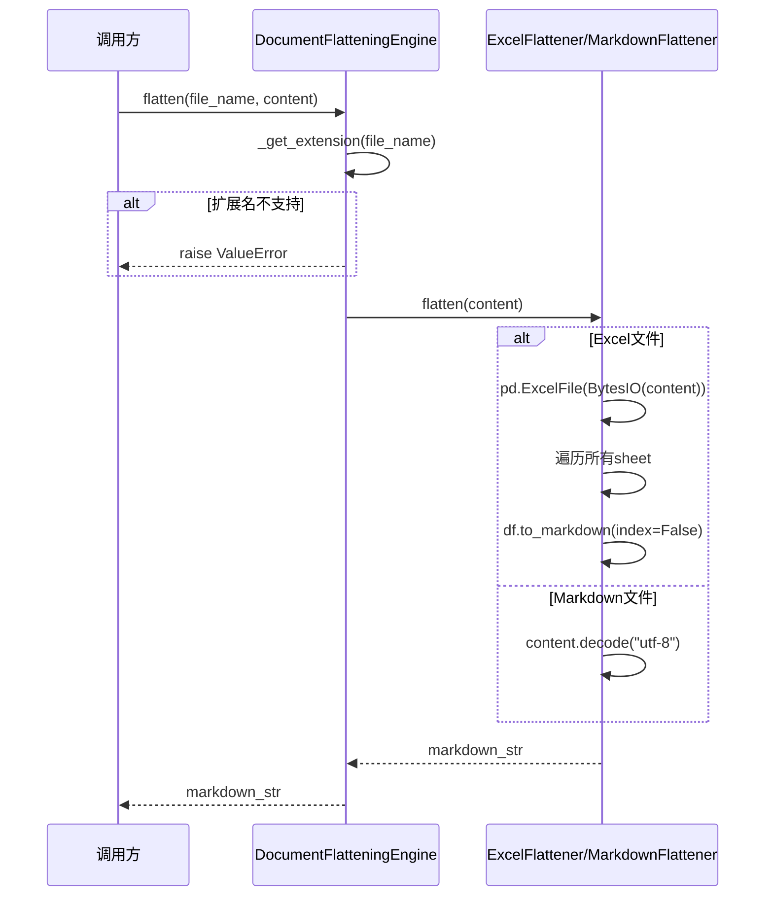

# DocumentFlatteningEngine 服务

## 服务概述

`DocumentFlatteningEngine` 是文档格式转换引擎，负责将多种格式的测试用例文档（Excel、Markdown）统一转换为 Markdown 纯文本，供下游 LLM 解析使用。

**文件位置**: `backend/app/services/document_flattening.py`

**单例实例**: `document_flattener`

## 设计模式

采用策略模式（Strategy Pattern），通过抽象基类 `DocumentFlattener` 定义统一接口，各格式实现独立的 Flattener 子类：

- `ExcelFlattener` — 处理 `.xlsx` / `.xls`
- `MarkdownFlattener` — 处理 `.md` / `.markdown`

## 核心函数

### `DocumentFlatteningEngine.flatten(file_name: str, content: bytes) -> str`

主入口函数，根据文件扩展名路由到对应的 Flattener。

| 参数 | 类型 | 说明 |
|------|------|------|
| `file_name` | `str` | 原始文件名（含扩展名） |
| `content` | `bytes` | 文件原始字节内容 |
| **返回值** | `str` | 转换后的 Markdown 文本 |

**异常**: `ValueError` — 文件类型不支持或无扩展名

### `DocumentFlatteningEngine.is_supported(file_name: str) -> bool`

检查文件类型是否受支持。

| 参数 | 类型 | 说明 |
|------|------|------|
| `file_name` | `str` | 文件名 |
| **返回值** | `bool` | 是否支持 |

### `ExcelFlattener.flatten(content: bytes) -> str`

将 Excel 文件转换为 Markdown 表格。遍历所有工作表，每个工作表生成一个二级标题 + Markdown 表格。

### `MarkdownFlattener.flatten(content: bytes) -> str`

将 Markdown 文件以 UTF-8 解码为字符串，不做额外转换。

## 支持的文件类型

| 扩展名 | Flattener | 说明 |
|--------|-----------|------|
| `.xlsx` | ExcelFlattener | Excel 2007+ |
| `.xls` | ExcelFlattener | Excel 97-2003 |
| `.md` | MarkdownFlattener | Markdown |
| `.markdown` | MarkdownFlattener | Markdown (备选扩展名) |

## UML 序列图

## 依赖关系

- **被依赖**: `IngestionService` — 在 `ingest_file()` 中调用
- **外部依赖**: `pandas` (Excel解析), `openpyxl` (Excel引擎)
