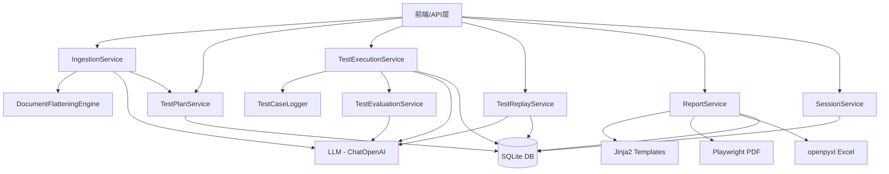
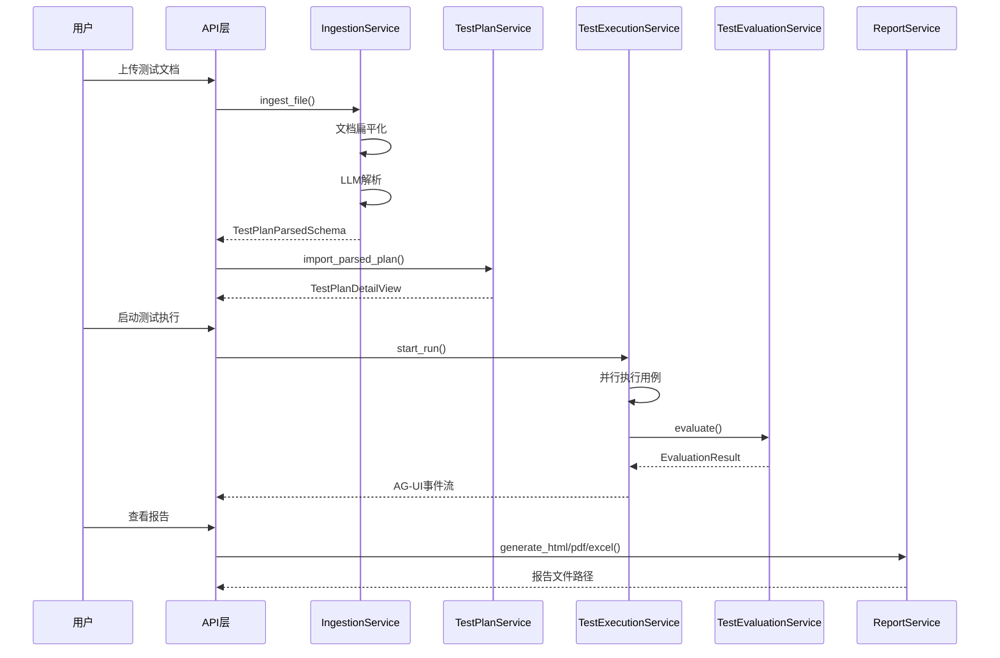

# 后端服务 Wiki 总览

本文档为 `backend/app/services/` 目录下所有服务的技术文档索引。

## 服务架构概览

## 服务列表

| 服务 | 文件 | 职责 |
|------|------|------|
| [DocumentFlatteningEngine](./document_flattening.md) | `document_flattening.py` | 文档格式转换（Excel/Markdown → 统一Markdown） |
| [IngestionService](./ingestion_service.md) | `ingestion_service.py` | LLM驱动的测试用例智能解析 |
| [TestPlanService](./test_plan_service.md) | `test_plan_service.py` | 测试计划与用例的CRUD管理 |
| [TestExecutionService](./test_execution_service.md) | `test_execution_service.py` | 并行测试执行引擎 |
| [TestEvaluationService](./test_evaluation_service.md) | `test_evaluation_service.py` | LLM驱动的测试结果评估 |
| [TestCaseLogger](./test_case_logger.md) | `test_case_logger.py` | 单用例执行日志记录器 |
| [TestReplayService](./test_replay_service.md) | `test_replay_service.py` | 测试轨迹回放引擎 |
| [ReportService](./report_service.md) | `report_service.py` | 多格式测试报告生成 |
| [SessionService](./session_service.md) | `session_service.py` | 会话与消息管理 |

## 数据流概览

## 技术栈

- **运行时**: Python 3.11+ (async)
- **数据库**: SQLite (aiosqlite)
- **LLM**: OpenAI兼容接口 (ChatOpenAI)
- **浏览器自动化**: browser-use (Agent + BrowserSession)
- **报告生成**: Jinja2 (HTML), Playwright (PDF), openpyxl (Excel)
- **文档解析**: pandas (Excel), 原生UTF-8 (Markdown)
