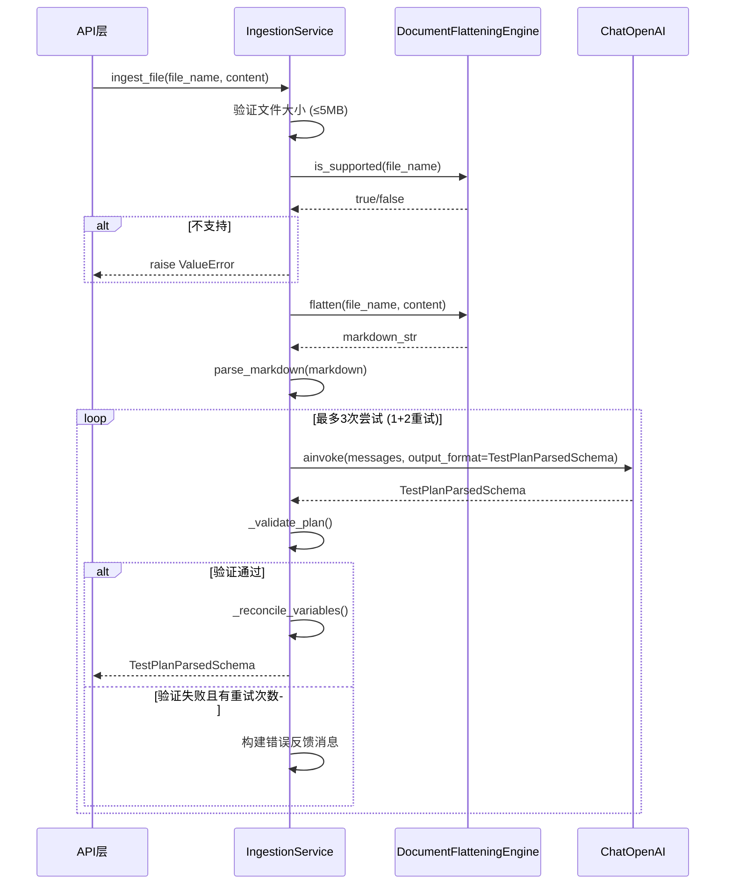

# IngestionService 服务

## 服务概述

`IngestionService` 是测试用例智能解析服务，通过 LLM 将非结构化的测试文档（Excel/Markdown）一次性解析为结构化的测试计划数据。核心能力包括：

1. **结构化提取** — 将测试用例拆解为有序步骤
2. **变量提取** — 识别可变参数并转化为占位符 `{variable_name}`
3. **用例合并** — 将步骤相同、仅变量值不同的用例合并

**文件位置**: `backend/app/services/ingestion_service.py`

**单例实例**: `ingestion_service`

## 核心函数

### `ingest_file(file_name: str, file_content: bytes) -> TestPlanParsedSchema`

文件摄入主入口。验证文件大小和类型后，调用文档扁平化引擎转换为 Markdown，再交由 LLM 解析。

| 参数 | 类型 | 说明 |
|------|------|------|
| `file_name` | `str` | 原始文件名（含扩展名） |
| `file_content` | `bytes` | 文件原始字节 |
| **返回值** | `TestPlanParsedSchema` | 解析后的测试计划结构 |

**约束**: 文件大小上限 5MB

### `ingest_markdown(markdown_content: str) -> TestPlanParsedSchema`

直接接收 Markdown 文本进行解析（跳过文件转换步骤）。

| 参数 | 类型 | 说明 |
|------|------|------|
| `markdown_content` | `str` | Markdown 文本 |
| **返回值** | `TestPlanParsedSchema` | 解析后的测试计划结构 |

### `parse_markdown(markdown_content: str, skip_validation: bool = False) -> TestPlanParsedSchema`

LLM 解析核心逻辑。使用结构化输出模式调用 LLM，支持最多 2 次重试。

| 参数 | 类型 | 说明 |
|------|------|------|
| `markdown_content` | `str` | 待解析的 Markdown |
| `skip_validation` | `bool` | 是否跳过占位符验证 |
| **返回值** | `TestPlanParsedSchema` | 解析结果 |

**重试机制**: 验证失败时将错误信息反馈给 LLM 重新解析，最多重试 `MAX_RETRIES=2` 次。

### `_reconcile_variables(plan: TestPlanParsedSchema) -> TestPlanParsedSchema`

变量协调函数。以文本中实际出现的 `{placeholder}` 为真实来源，重新计算 `step_variables` 和 `global_variables`。

### `_validate_plan(plan: TestPlanParsedSchema) -> list[str]`

验证解析结果中的占位符格式（检测未闭合或空占位符）。

## UML 序列图

## 依赖关系

- **依赖**: `DocumentFlatteningEngine` — 文档格式转换
- **依赖**: `ChatOpenAI` (browser_use.llm) — LLM 调用
- **依赖**: `Config` — LLM 模型配置
- **被依赖**: API 路由层 — 文件上传接口
- **输出消费者**: `TestPlanService.import_parsed_plan()` — 将解析结果持久化
