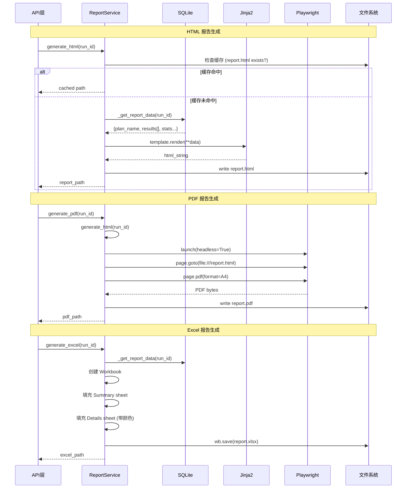

# ReportService 服务

## 服务概述

`ReportService` 负责生成多格式的测试执行报告，支持 HTML、PDF 和 Excel 三种输出格式。内置缓存机制，相同运行 ID 的报告只生成一次。

**文件位置**: `backend/app/services/report_service.py`

**单例实例**: `report_service`

## 核心函数

### `generate_html(run_id: str) -> Path`

生成 HTML 报告。使用 Jinja2 模板渲染，输出到 `{REPORTS_DIR}/{run_id}/report.html`。

| 参数 | 类型 | 说明 |
|------|------|------|
| `run_id` | `str` | 测试运行 ID |
| **返回值** | `Path` | 生成的 HTML 文件路径 |

### `generate_pdf(run_id: str) -> Path`

生成 PDF 报告。先确保 HTML 存在，再通过 Playwright 无头浏览器将 HTML 转为 A4 格式 PDF。

| 参数 | 类型 | 说明 |
|------|------|------|
| `run_id` | `str` | 测试运行 ID |
| **返回值** | `Path` | 生成的 PDF 文件路径 |

### `generate_excel(run_id: str) -> Path`

生成 Excel 报告，包含两个工作表：

- **Summary** — 计划名称、运行ID、时间、通过率等摘要信息
- **Details** — 每个用例的名称、状态、耗时、评估总结、错误信息

状态单元格带颜色标记：passed=绿色、failed=红色、error=黄色。

| 参数 | 类型 | 说明 |
|------|------|------|
| `run_id` | `str` | 测试运行 ID |
| **返回值** | `Path` | 生成的 Excel 文件路径 |

### `invalidate_cache(run_id: str) -> None`

清除指定运行的缓存报告（例如结果被覆盖后需要重新生成）。

### `_get_report_data(run_id: str) -> dict`

内部方法，从数据库获取报告所需的全部数据：运行信息、结果列表、统计指标、失败截图等。

**返回数据结构**:
- `run_id`, `plan_name`, `started_at`, `duration`
- `total`, `passed`, `failed`, `error_count`, `pass_rate`
- `results[]` — 每个用例的详细结果（含检查点、失败截图base64）

## UML 序列图

## 缓存策略

- 报告按 `{REPORTS_DIR}/{run_id}/` 目录组织
- 文件存在即视为缓存命中，直接返回路径
- `invalidate_cache()` 删除整个运行目录（`shutil.rmtree`）

## 依赖关系

- **依赖**: `Jinja2` — HTML 模板渲染
- **依赖**: `Playwright` — HTML → PDF 转换
- **依赖**: `openpyxl` — Excel 生成
- **依赖**: `Config.REPORTS_DIR` — 报告存储路径
- **被依赖**: API 路由层 — 报告下载接口
- **被依赖**: `TestExecutionService` — 执行完成后生成报告链接
