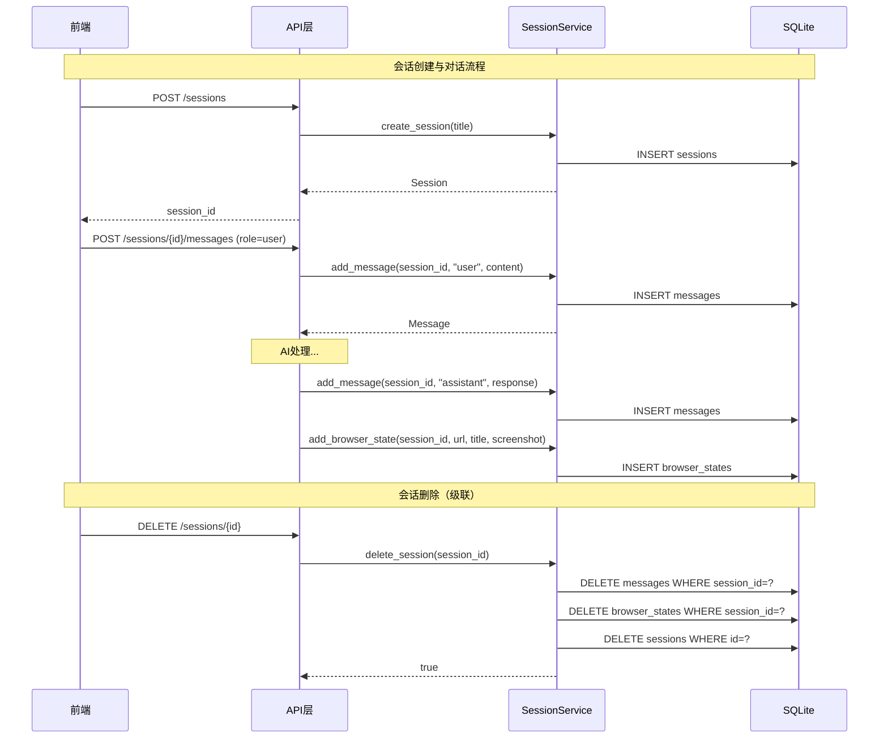

# SessionService 服务

## 服务概述

`SessionService` 管理聊天会话（Session）的完整生命周期，包括会话的创建、查询、更新、删除，以及会话内消息和浏览器状态的管理。是 AI 对话工作区的数据层。

**文件位置**: `backend/app/services/session_service.py`

**单例实例**: `session_service`

## 核心函数

### 会话管理

#### `list_sessions() -> list[Session]`

列出所有会话（按更新时间降序）。

#### `get_session(session_id: str) -> Session | None`

按 ID 获取单个会话。

#### `create_session(title: str = 'New conversation', session_id: str | None = None) -> Session`

创建新会话。支持自定义 ID（用于前端预生成）。

| 参数 | 类型 | 说明 |
|------|------|------|
| `title` | `str` | 会话标题（默认 'New conversation'） |
| `session_id` | `str \| None` | 可选的自定义 ID |
| **返回值** | `Session` | 创建的会话对象 |

#### `update_session(session_id: str, title: str) -> Session | None`

更新会话标题。

#### `delete_session(session_id: str) -> bool`

删除会话及其关联的消息和浏览器状态。

### 消息管理

#### `get_messages(session_id: str) -> list[Message]`

获取会话的所有消息（按创建时间升序）。自动解析 `attachments` JSON 字段。

#### `add_message(session_id: str, role: str, content: str, attachments: str = '[]') -> Message`

添加消息到会话。

| 参数 | 类型 | 说明 |
|------|------|------|
| `session_id` | `str` | 会话 ID |
| `role` | `str` | 角色（user/assistant） |
| `content` | `str` | 消息内容 |
| `attachments` | `str` | 附件 JSON 数组 |
| **返回值** | `Message` | 创建的消息对象 |

### 浏览器状态

#### `add_browser_state(session_id, url, title, screenshot) -> dict`

记录浏览器状态快照（URL、标题、截图）。

#### `get_browser_states(session_id: str) -> list[dict]`

获取会话的所有浏览器状态记录。

## UML 序列图



## 数据模型

### Session
```python
class Session:
    id: str
    title: str
    created_at: datetime
    updated_at: datetime
```

### Message
```python
class Message:
    id: str
    session_id: str
    role: str  # "user" | "assistant"
    content: str
    attachments: list[Attachment]
    created_at: datetime
```

## 依赖关系

- **依赖**: `aiosqlite` — 数据库操作
- **依赖**: `uuid_extensions` — ID 生成
- **被依赖**: API 路由层 — 会话和消息 CRUD 接口
- **被依赖**: WebSocket 处理器 — 实时对话消息存储
