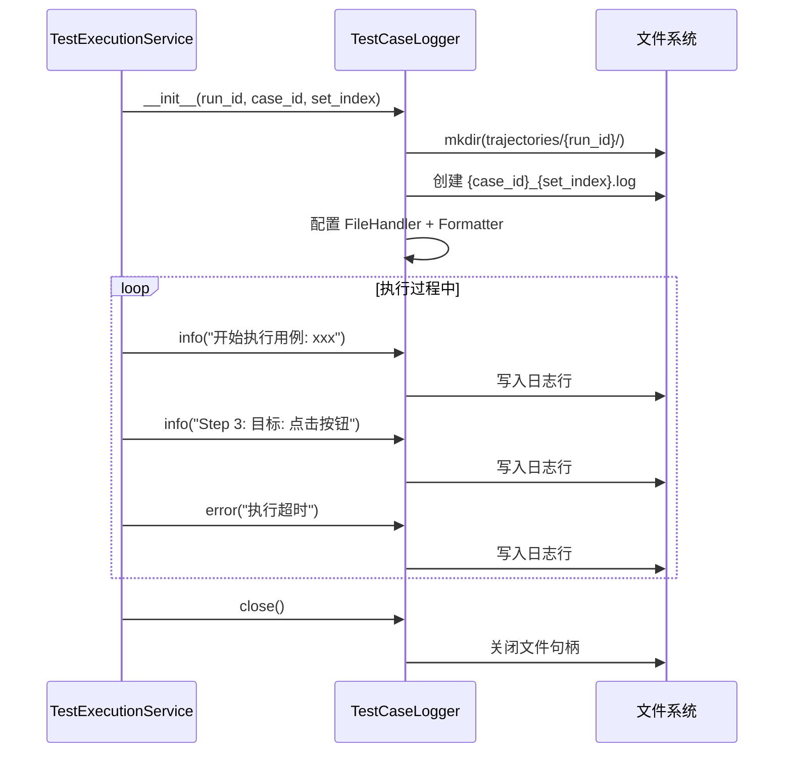

# TestCaseLogger 服务

## 服务概述

`TestCaseLogger` 是单用例执行日志记录器，为每次测试用例执行创建独立的日志文件。日志文件路径格式：

```
data/trajectories/{run_id}/{case_id}_{set_index}.log
```

**文件位置**: `backend/app/services/test_case_logger.py`

## 设计特点

- 每个用例执行实例拥有独立的 Logger 和 FileHandler
- 日志不向上传播（`propagate = False`），避免污染全局日志
- 支持 DEBUG 级别的详细记录
- 日志格式：`[2026-05-26 10:30:00] [INFO] 消息内容`

## 核心函数

### `__init__(run_id: str, case_id: str, set_index: int = 0)`

构造函数，创建日志目录和文件。

| 参数 | 类型 | 说明 |
|------|------|------|
| `run_id` | `str` | 测试运行 ID |
| `case_id` | `str` | 测试用例 ID |
| `set_index` | `int` | 变量集索引（默认0） |

### `info(message: str) -> None`

记录 INFO 级别日志。

### `warn(message: str) -> None`

记录 WARNING 级别日志。

### `error(message: str) -> None`

记录 ERROR 级别日志。

### `debug(message: str) -> None`

记录 DEBUG 级别日志。

### `close() -> None`

关闭文件句柄，释放资源。

### `log_path -> Path` (property)

返回日志文件路径。

## UML 序列图



## 依赖关系

- **依赖**: `Config.TRAJECTORY_DIR` — 日志存储根目录
- **被依赖**: `TestExecutionService` — 在 `_execute_with_retry` 中创建和使用
- **被依赖**: SSE 日志流 — 通过 `get_logger_for_result()` 获取活跃 Logger 的文件路径进行流式读取
