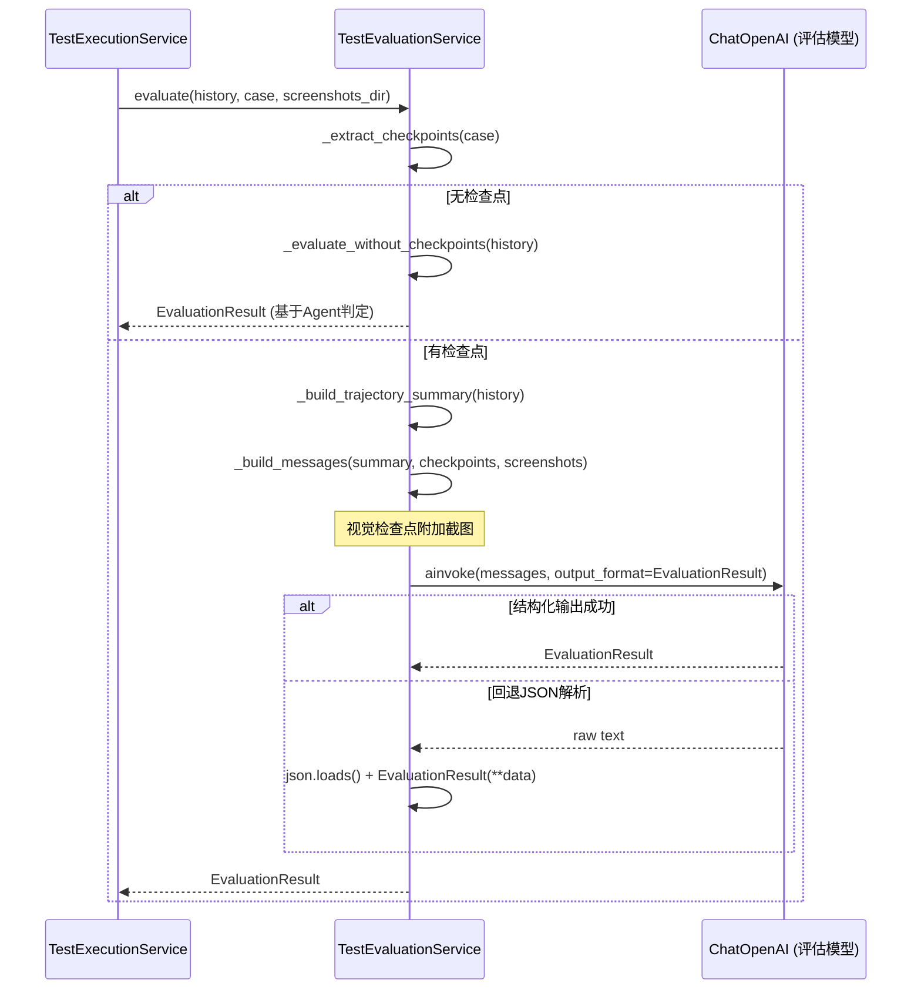

# TestEvaluationService 服务

## 服务概述

`TestEvaluationService` 是基于 LLM 的测试结果评估服务。通过分析 Agent 执行轨迹，对照测试用例中定义的检查点（expected_result），判定每个检查点是否通过。支持视觉检查点（通过截图进行多模态评估）。

**文件位置**: `backend/app/services/test_evaluation_service.py`

**单例实例**: `test_evaluation_service`

## 评估逻辑

1. 提取用例中带有 `expected_result` 的步骤作为检查点
2. 构建执行轨迹摘要（URL、操作、结果）
3. 调用评估 LLM 对每个检查点判定 pass/fail/inconclusive
4. 整体结论：全部 pass → passed；任一 fail → failed；全部 inconclusive → error

## 核心函数

### `evaluate(history, case: dict, screenshots_dir: Path | None) -> EvaluationResult`

评估主入口。

| 参数 | 类型 | 说明 |
|------|------|------|
| `history` | `AgentHistoryList` | Agent 执行历史 |
| `case` | `dict` | 用例快照（含 steps_json） |
| `screenshots_dir` | `Path \| None` | 步骤截图目录 |
| **返回值** | `EvaluationResult` | 评估结果（含各检查点详情） |

### `_extract_checkpoints(case: dict) -> list[dict]`

从用例步骤中提取有 `expected_result` 的步骤作为检查点。

| 返回字段 | 说明 |
|----------|------|
| `step_number` | 步骤序号 |
| `action_description` | 操作描述 |
| `expected_result` | 预期结果 |
| `is_visual_checkpoint` | 是否为视觉检查点 |

### `_build_trajectory_summary(history) -> str`

将 Agent 执行历史压缩为文本摘要（最大 3000 字符），包含每步的 URL、评估、目标、错误和提取内容。

### `_build_messages(trajectory_summary, checkpoints, screenshots_dir) -> list`

构建 LLM 消息列表。对视觉检查点附加对应步骤的截图（base64 编码）。

### `_call_llm(messages) -> EvaluationResult`

调用评估 LLM。优先使用结构化输出模式，失败时回退到 JSON 手动解析。

### `_evaluate_without_checkpoints(history) -> EvaluationResult`

无检查点时的降级评估：直接使用 Agent 自身的 `is_done` + `success` 判定。

## UML 序列图



## 评估结果结构

```python
class EvaluationResult:
    overall_status: str  # "passed" | "failed" | "error"
    checkpoints: list[CheckpointEvaluation]
    execution_errors: list[str]
    summary: str

class CheckpointEvaluation:
    step_number: int
    expected_result: str
    actual_observation: str
    verdict: str  # "pass" | "fail" | "inconclusive"
    reasoning: str
```

## 依赖关系

- **依赖**: `ChatOpenAI` — 评估 LLM 调用
- **依赖**: `Config.EVAL_LLM_MODEL` — 评估专用模型配置
- **依赖**: `browser_use.llm.messages` — 消息类型构建
- **被依赖**: `TestExecutionService._execute_case_inner()` — 执行后调用评估
