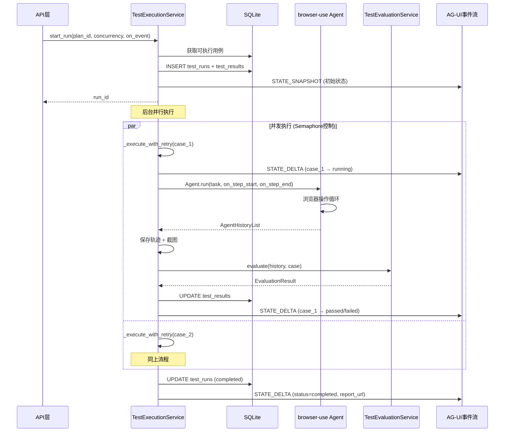
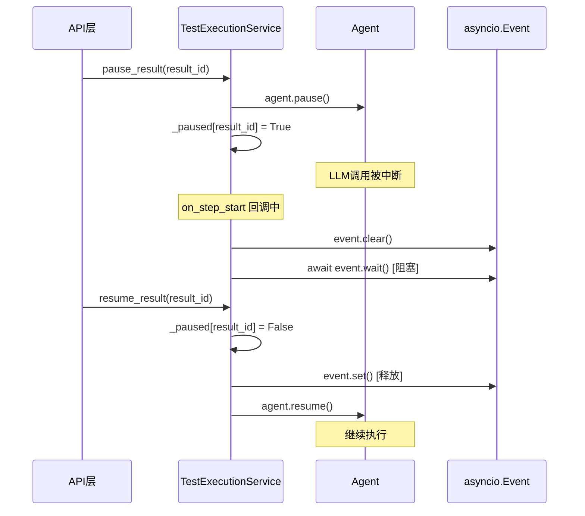

# TestExecutionService 服务

## 服务概述

`TestExecutionService` 是并行测试执行引擎，负责管理测试运行的完整生命周期：启动、并发控制、超时管理、重试逻辑、暂停/恢复、中止，以及通过 AG-UI 事件实时推送执行进度。

**文件位置**: `backend/app/services/test_execution_service.py`

**单例实例**: `test_execution_service`

## 核心函数

### 运行管理

#### `start_run(plan_id, max_concurrency, on_event, ...) -> str`

启动测试运行。创建运行记录和结果记录，发射初始 STATE_SNAPSHOT 事件，然后在后台启动并行执行。

| 参数 | 类型 | 说明 |
|------|------|------|
| `plan_id` | `str` | 测试计划 ID |
| `max_concurrency` | `int` | 最大并发数 |
| `on_event` | `Callable` | AG-UI 事件回调 |
| `case_ids` | `list[str] \| None` | 指定执行的用例 ID |
| `rerun_failed` | `str \| None` | 重跑某次运行的失败用例 |
| `max_retries` | `int` | 最大重试次数（默认1） |
| `case_timeout_seconds` | `int` | 单用例超时（默认600s） |
| **返回值** | `str` | 运行 ID |

#### `abort_run(run_id: str) -> None`

中止运行中的测试。取消所有活跃任务，关闭浏览器会话，更新数据库状态。

#### `retry_result(result_id: str, on_event) -> str`

重试单个失败/错误的测试结果。

### 用例控制

#### `pause_result(result_id: str) -> bool`

暂停正在执行的用例。调用 `agent.pause()` 中断当前 LLM 调用。

#### `resume_result(result_id: str) -> bool`

恢复已暂停的用例。调用 `agent.resume()` 并释放步骤等待锁。

#### `stop_result(result_id: str) -> bool`

立即停止用例执行。调用 `agent.stop()`，关闭浏览器，标记为 failed。

### 内部执行

#### `_run_all_cases(run_id, cases, max_concurrency, ...) -> None`

使用 `asyncio.Semaphore` 控制并发，执行所有用例并汇总结果。完成后更新运行状态并发射完成事件。

#### `_execute_with_retry(run_id, case, ...) -> str`

单用例重试包装器。在 error 状态下重试（不对 fail 重试），记录每次尝试的日志。

#### `_execute_case_inner(run_id, case, case_logger) -> str`

实际执行逻辑：创建浏览器会话 → 构建 Agent → 运行 → 保存轨迹 → 调用评估服务 → 返回状态。

### 辅助功能

#### `take_screenshot(result_id: str) -> str | None`

获取正在执行用例的实时浏览器截图（base64 PNG）。

#### `get_step_screenshots(result_id: str) -> list[dict]`

获取已完成用例的所有步骤截图。

#### `recover_on_startup() -> None`

服务启动时清理上次崩溃残留的 running 状态。

#### `cleanup_old_trajectories() -> None`

清理超过保留期限的轨迹目录。

## UML 序列图

### 暂停/恢复流程

## 状态管理

服务维护多个内部字典跟踪活跃状态：

| 字典 | Key | Value | 用途 |
|------|-----|-------|------|
| `_active_tasks` | run_id | `set[asyncio.Task]` | 活跃任务（用于中止） |
| `_active_sessions` | run_id | `list[BrowserSession]` | 浏览器会话（用于强制关闭） |
| `_active_agents` | result_id | `Agent` | Agent实例（用于暂停/恢复） |
| `_result_sessions` | result_id | `BrowserSession` | 会话映射（用于实时截图） |
| `_pause_events` | result_id | `asyncio.Event` | 暂停信号 |
| `_active_loggers` | result_id | `TestCaseLogger` | 日志器（用于SSE流式日志） |

## 依赖关系

- **依赖**: `TestEvaluationService` — 用例执行后的结果评估
- **依赖**: `TestCaseLogger` — 每用例独立日志
- **依赖**: `browser-use` (Agent, BrowserSession) — 浏览器自动化
- **依赖**: `ChatOpenAI` — LLM 驱动 Agent
- **依赖**: `Config` — 超时、并发、模型配置
- **被依赖**: API 路由层 — 执行控制接口
- **事件消费者**: 前端 SSE 连接 — 实时进度展示
