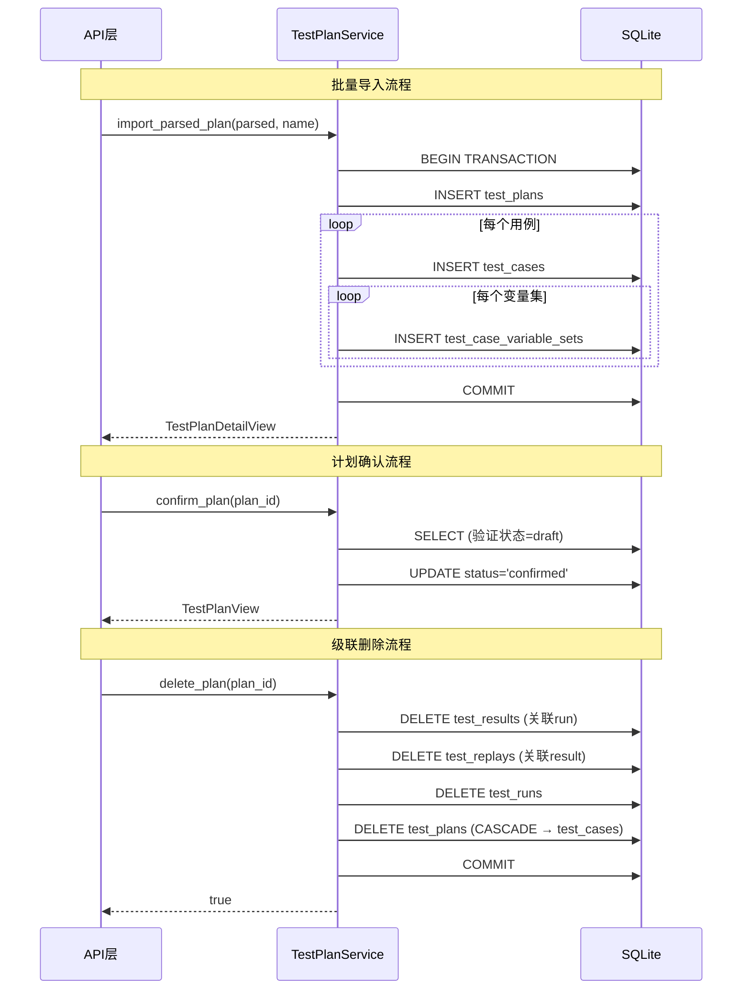

# TestPlanService 服务

## 服务概述

`TestPlanService` 提供测试计划、测试用例和变量集的完整 CRUD 操作。是数据持久化层的核心服务，所有测试数据的创建、查询、更新、删除都通过此服务完成。

**文件位置**: `backend/app/services/test_plan_service.py`

**单例实例**: `test_plan_service`

## 核心函数

### 测试计划 CRUD

#### `create_plan(data: TestPlanCreate) -> TestPlanView`

创建新的测试计划。

| 参数 | 类型 | 说明 |
|------|------|------|
| `data` | `TestPlanCreate` | 包含 name, description, source_file_name, max_concurrency |
| **返回值** | `TestPlanView` | 创建后的计划视图 |

#### `get_plan(plan_id: str) -> TestPlanView | None`

按 ID 获取测试计划。

#### `list_plans() -> list[TestPlanView]`

列出所有测试计划（按创建时间降序），附带用例数量统计。

#### `update_plan(plan_id: str, data: TestPlanUpdate) -> TestPlanView`

更新测试计划。使用字段白名单 `_PLAN_UPDATE_FIELDS` 防止 SQL 注入。

#### `delete_plan(plan_id: str) -> bool`

级联删除测试计划及其关联的用例、运行记录、结果和回放记录。

#### `confirm_plan(plan_id: str) -> TestPlanView`

确认计划（draft → confirmed 状态转换）。

### 测试用例 CRUD

#### `create_case(plan_id: str, data: TestCaseCreate) -> TestCaseView`

在指定计划下创建测试用例。

#### `get_case(case_id: str) -> TestCaseView | None`

按 ID 获取测试用例，自动解析 `steps_json`、`global_variables`、`variable_values_json`。

#### `list_cases(plan_id: str) -> list[TestCaseView]`

列出计划下所有用例（按 execution_order 升序）。

#### `update_case(case_id: str, data: TestCaseUpdate) -> TestCaseView`

更新测试用例。使用字段白名单 `_CASE_UPDATE_FIELDS` 防止 SQL 注入。

#### `delete_case(case_id: str) -> bool`

删除测试用例及其变量集。

### 变量集管理

#### `create_variable_sets(case_id: str, variable_sets: list[dict[str, str]]) -> list[VariableSetView]`

为用例批量创建变量集。

#### `get_variable_sets(case_id: str) -> list[VariableSetView]`

获取用例的所有变量集（按 set_index 排序）。

#### `delete_variable_set(variable_set_id: str) -> bool`

删除单个变量集。

### 批量导入

#### `import_parsed_plan(parsed: TestPlanParsedSchema, name: str, ...) -> TestPlanDetailView`

原子性导入 LLM 解析结果。在单个事务中插入计划 + 所有用例 + 所有变量集，失败时全部回滚。

#### `get_plan_detail(plan_id: str) -> TestPlanDetailView | None`

获取计划详情（含所有用例列表）。

## UML 序列图

## 安全设计

- **SQL 注入防护**: 使用字段白名单 (`_PLAN_UPDATE_FIELDS`, `_CASE_UPDATE_FIELDS`) 验证动态列名
- **参数化查询**: 所有 SQL 使用 `?` 占位符
- **事务原子性**: `import_parsed_plan` 使用显式 BEGIN/COMMIT/ROLLBACK

## 依赖关系

- **被依赖**: API 路由层 — 所有计划/用例 CRUD 接口
- **被依赖**: `TestExecutionService` — 获取可执行用例
- **输入来源**: `IngestionService` — 提供 `TestPlanParsedSchema`
- **外部依赖**: `aiosqlite`, `uuid_extensions`
