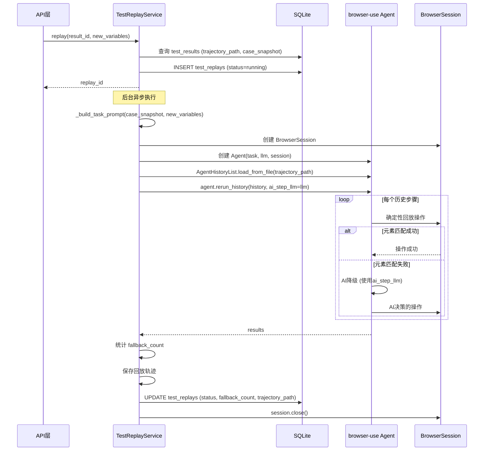

# TestReplayService 服务

## 服务概述

`TestReplayService` 是测试轨迹回放引擎，支持将已录制的测试执行轨迹通过 `Agent.rerun_history()` 进行回放。采用混合模式（hybrid）：优先确定性回放，元素匹配失败时自动降级为 AI 辅助执行。

**文件位置**: `backend/app/services/test_replay_service.py`

**单例实例**: `test_replay_service`

## 核心函数

### `replay(result_id: str, new_variables: dict[str, str] | None = None) -> str`

启动回放。立即返回 `replay_id`，实际执行在后台异步进行。

| 参数 | 类型 | 说明 |
|------|------|------|
| `result_id` | `str` | 原始测试结果 ID |
| `new_variables` | `dict \| None` | 可选的新变量值（覆盖原始变量） |
| **返回值** | `str` | 回放记录 ID |

**流程**:
1. 从 DB 加载原始结果的轨迹路径和用例快照
2. 创建 `test_replays` 记录（status=running）
3. 启动后台 `asyncio.Task` 执行回放

### `_run_replay(replay_id, result_id, trajectory_path, case_snapshot, new_variables) -> None`

后台回放执行逻辑。

**执行步骤**:
1. 创建 LLM 实例（用于 AI 降级）
2. 从用例快照构建任务提示词
3. 创建 BrowserSession 和 Agent
4. 加载历史轨迹文件
5. 调用 `agent.rerun_history()` 执行回放
6. 统计 AI 降级次数
7. 保存回放轨迹并更新 DB

### `_build_task_prompt(case_snapshot: dict, new_variables: dict | None) -> str`

从用例快照构建 Agent 任务提示词，支持变量替换。

### `_update_replay_record(replay_id, status, fallback_count, trajectory_path) -> None`

更新回放记录的最终状态。

### `get_replay(replay_id: str) -> dict | None`

查询单个回放记录。

## UML 序列图

## 回放模式

| 模式 | 说明 |
|------|------|
| `hybrid` | 默认模式。确定性回放 + AI 降级 |
| 确定性回放 | 按录制的操作序列精确重放 |
| AI 降级 | 元素匹配失败时，使用 LLM 决策替代操作 |

## 回放参数

| 参数 | 值 | 说明 |
|------|-----|------|
| `max_retries` | 3 | 单步最大重试次数 |
| `skip_failures` | True | 跳过失败步骤继续执行 |
| `delay_between_actions` | 2.0s | 操作间延迟 |

## 依赖关系

- **依赖**: `browser-use` (Agent, BrowserSession, AgentHistoryList) — 回放执行
- **依赖**: `ChatOpenAI` — AI 降级时的 LLM
- **依赖**: `Config` — 模型配置
- **被依赖**: API 路由层 — 回放触发和查询接口
